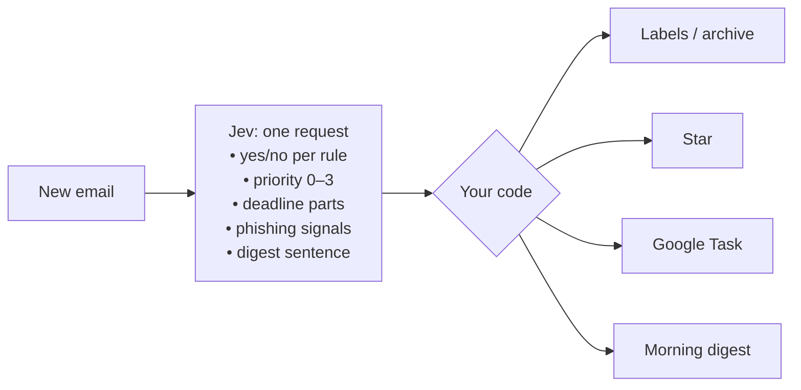

# jev-mail-filter

**Gmail filters you write in plain English.**
[Jev](https://docs.typesafe.ai) reads every new email and labels, stars, archives it, turns it into a to-do, or flags it as phishing.
Every morning it sends you a digest, and it reminds you about emails you sent that are still waiting on a reply.

> ~300 lines · one Apps Script file · no server · no OAuth app · 5-minute setup, no coding

## Gmail's filters can't do this

Gmail's own filters match on words and senders. They can't tell *"my manager needs this by Friday"* apart from *"50% off, ends Friday!"*.

Here, a filter is just a sentence:

```js
const RULES = [
  { label: 'Jev/Needs reply', rule: 'A real person wrote this email to me personally and is waiting for my answer or action.' },
  { label: 'Jev/Newsletter',  rule: 'This email is a newsletter, marketing promotion, or bulk mailing rather than a personal message.', archive: true },
  { label: 'Jev/Receipts',    rule: 'This email is a receipt, invoice, or order/shipping confirmation for a purchase.' },
];
```

## What it does to your inbox

| Email | What happens |
|---|---|
| *"Your order #112-3345 has shipped"* | labeled **Receipts** |
| *"Markets rally as Fed holds"* | labeled **Newsletter**, archived |
| *"Can you send me your comments on the contract **by Friday**?"* | labeled **Needs reply**, starred, **task due Friday** |
| *"New sign-in on Windows"* | labeled **Security**, starred |
| *"URGENT prod is down, customers can't pay"* | labeled **Needs reply**, starred |
| *"Your account has been limited"* from `paypa1-account-verify.com` | labeled **Suspicious**, not starred, no task |

These are real Jev answers on sample emails. Try it on your own inbox and tune from there.

## Features

- **Plain-English labels.** Each rule is one yes/no question. An email can match several rules.
- **Priority stars.** Every email gets a 0–3 importance score. Anything that needs you gets a star.
- **Deadlines become Google Tasks.** It understands *"by Friday"*, *"tomorrow"*, *"next Monday"* and *"before October 3"*, and sets the right due date.
- **Phishing flag.** Mail that pretends to be a brand from someone else's domain and asks for a password, card, or quick action gets labeled `Jev/Suspicious`.
- **Morning digest.** At 8:00 you get one email listing yesterday's mail, most important first, each with the one sentence worth reading. Jev *picks* that sentence from the email and never writes one, so nothing is made up.
- **Waiting on them.** When you send a question or a request and get no reply in 3 days, the thread comes back to your inbox labeled `Jev/Waiting on them` and shows up in your digest.
- **Auto-archive.** Add `archive: true` to a rule and matching emails leave your inbox.
- **Plays it safe.** If Jev isn't sure, nothing happens. It never sends or deletes anything.

## How it works



Every 10 minutes, each new inbox thread goes to Jev in **a single request**, and all the questions are answered in parallel.
Jev doesn't write text. It returns **probabilities**, and plain code decides what to do with them.

For deadlines, Jev only picks out the parts of the date (*which month? which day? "tomorrow"? "next Monday"?*).
The calendar math is done in code, counting from when the email was sent. That makes it deterministic and easy to check.

## Setup (about 5 minutes, no coding)

You need a Google account and a computer with a browser. Everything below is point-and-click.

**What gets shared:** the script runs inside your own Google account. For each new email it sends the sender, subject, and the first 2,000 characters of the text to TypeSafe's API to get Jev's answers. Nothing else leaves your account, and nobody else, including the author of this repo, gets access to your mail.

### 1. Get a TypeSafe API key

Sign up at [typesafe.ai](https://typesafe.ai) and create an API key. Copy it somewhere handy, you'll paste it in step 4.

### 2. Create the script

1. Open [script.google.com](https://script.google.com) and sign in with the Gmail account you want to filter.
2. Click **New project** in the top left.
3. Click **Untitled project** at the top and rename it to `Jev mail filter`.

### 3. Paste the code

1. Open [`Code.gs` in raw form](https://raw.githubusercontent.com/ziyacivan/jev-mail-filter/main/Code.gs), select all (`Ctrl+A` / `Cmd+A`) and copy it.
2. Back in the script editor, select all the code that's already there (`function myFunction() {…}`) and delete it.
3. Paste, then save with `Ctrl+S` / `Cmd+S`.

### 4. Add your API key

1. In the left sidebar, click the gear icon (**Project Settings**).
2. Scroll to the bottom, then click **Add script property**.
3. Enter `TYPESAFE_API_KEY` as the **Property** and your key from step 1 as the **Value**.
4. Click **Save script properties**.

### 5. Turn on Google Tasks

This is what turns deadlines into tasks.

1. In the left sidebar, click **Editor** (the `< >` icon).
2. Next to **Services**, click the **＋**.
3. Pick **Google Tasks API** from the list and click **Add**.

### 6. Run it once

1. At the top of the editor there's a dropdown next to **Run** and **Debug**. Choose `run` in it.
2. Click **Run**.
3. A window asks for permission. Click **Review permissions** and pick your account.
4. You'll see *"Google hasn't verified this app"*. That's expected, because the app is your own copy and nobody has submitted it to Google. Click **Advanced**, then **Go to Jev mail filter (unsafe)**.
5. Click **Allow**.
6. Wait for **Execution completed** in the log at the bottom, then refresh Gmail. New labels appear under **Jev** in the left sidebar.

### 7. Turn it on for good

Choose `install` in the same dropdown and click **Run**. From now on it checks your mail every 10 minutes and sends you a digest every morning at 8:00. You can close the tab.

### Make it yours (optional)

The first lines of the code hold the settings. `RULES` is your list of filters, one sentence each. Edit, add, or delete rules, then save. Label names can be anything, and `Jev/` just groups them in Gmail's sidebar. See [Tuning](#tuning) for the other settings.

### Troubleshooting

- **Stuck on "Loading data…" or the permission window never opens.** Open a private/incognito window, sign in with *only* the Google account you want to filter, and try again. Apps Script can hang when several accounts are signed in at once.
- **`Tasks is not defined`.** Step 5 was skipped.
- **`TypeSafe 401`.** The API key is missing or mistyped. Check step 4, and make sure the property name is exactly `TYPESAFE_API_KEY`.
- **Nothing happened.** On the first run it only looks at the last 2 days of mail. Check **Executions** (the list icon in the left sidebar) for errors.

### Updating

Copy the new [`Code.gs`](https://raw.githubusercontent.com/ziyacivan/jev-mail-filter/main/Code.gs) over the old one, save, and run `install` again. If you had edited `RULES`, copy those back in.

### Uninstalling

Open your project at [script.google.com](https://script.google.com), click the clock icon (**Triggers**) and delete both triggers, or just delete the whole project. The labels stay in Gmail until you remove them.

## Tuning

| Setting | Default | What it does |
|---|---|---|
| `THRESHOLD` | `0.7` | Probability a rule needs before its label is applied |
| `STAR_AT` | `2` | Priority score (0–3) that earns a star |
| `PRIORITY_LEVELS` | 4 levels | What each priority score means, in plain English |
| `MIN_DATE_CONFIDENCE` | `0.6` | How sure Jev must be about every part of a date before a task is created |
| `DIGEST_HOUR` | `8` | Hour of the day the digest is sent |
| `WAIT_DAYS` | `3` | Days without a reply before a sent email comes back to your inbox |

**Writing good rules:** Jev reads your rules literally, so state the exact condition rather than a vibe.
If an email gets mislabeled, whatever you'd say to explain what you *meant* is the part missing from the rule.

**Phishing** is flagged when both hold:
1. the sender's domain isn't one the claimed company, bank, or service owns (Jev), *or* Reply-To goes to a different domain (code), and
2. the email asks for a login, password, code, or card details, *or* threatens a bad outcome unless you act now (Jev).

Flagged mail is never starred or turned into a task. It's a strong hint, not a guarantee, so keep your judgment on.

**New replies count.** Each run looks at every thread whose newest message arrived since the last run, so a reply that adds a deadline or turns urgent is picked up. When the newest message is yours, it only checks whether you asked them for something.

**Reprocessing:** the script remembers where it left off in the `CURSOR` script property. Delete it to go back over the last 2 days.

Built with [Jev](https://docs.typesafe.ai) by TypeSafe: small, fast models that return typed answers and probabilities instead of text.
