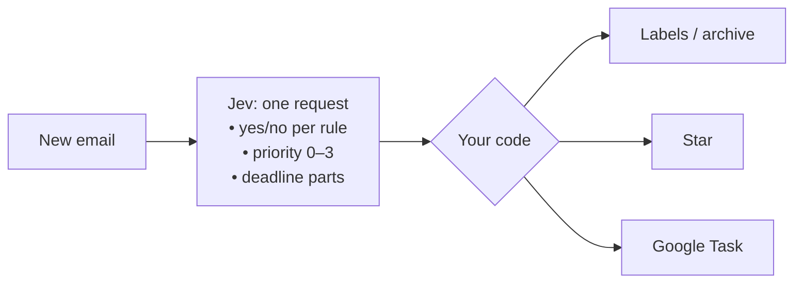

# jev-mail-filter

**Gmail filters you write in plain English.**
[Jev](https://docs.typesafe.ai) reads every new email and labels, stars, archives it, or turns it into a to-do for you.

> ~150 lines · one Apps Script file · no server · no OAuth app · 2-minute setup

## Gmail's filters can't do this

Gmail's own filters match on words and senders. They can't tell *"my manager needs this by Friday"* apart from *"50% off, ends Friday!"*.

Here, a filter is just a sentence:

```js
const RULES = [
  { label: 'Jev/Needs reply', rule: 'A real person wrote this email to me personally and is waiting for my answer or action.' },
  { label: 'Jev/Newsletter',  rule: 'This email is a newsletter, marketing promotion, or bulk mailing rather than a personal message.', archive: true },
  { label: 'Jev/Receipts',    rule: 'This email is a receipt, invoice, or order/shipping confirmation for a purchase.' },
];
```

## What it does to your inbox

| Email | What happens |
|---|---|
| *"Your order #112-3345 has shipped"* | labeled **Receipts** |
| *"Markets rally as Fed holds"* | labeled **Newsletter**, archived |
| *"Can you send me your comments on the contract **by Friday**?"* | labeled **Needs reply**, starred, **task due Friday** |
| *"New sign-in on Windows"* | labeled **Security**, starred |
| *"URGENT prod is down, customers can't pay"* | labeled **Needs reply**, starred |

These are real Jev answers on sample emails. Try it on your own inbox and tune from there.

## Features

- **Plain-English labels.** Each rule is one yes/no question. An email can match several rules.
- **Priority stars.** Every email gets a 0–3 importance score. Anything that needs you gets a star.
- **Deadlines become Google Tasks.** It understands *"by Friday"*, *"tomorrow"*, *"next Monday"* and *"before October 3"*, and sets the right due date.
- **Auto-archive.** Add `archive: true` to a rule and matching emails leave your inbox.
- **Plays it safe.** If Jev isn't sure, nothing happens. It never sends or deletes anything.

## How it works



Every 10 minutes, each new inbox thread goes to Jev in **a single request**, and all the questions are answered in parallel.
Jev doesn't write text. It returns **probabilities**, and plain code decides what to do with them.

For deadlines, Jev only picks out the parts of the date (*which month? which day? "tomorrow"? "next Monday"?*).
The calendar math is done in code, counting from when the email was sent. That makes it deterministic and easy to check.

## Setup (2 min)

1. Get a TypeSafe API key at [typesafe.ai](https://typesafe.ai).
2. Go to [script.google.com](https://script.google.com) → **New project**, then paste in [`Code.gs`](Code.gs).
3. **Project Settings** → **Script Properties** → add `TYPESAFE_API_KEY`.
4. **Services** (the ＋ in the left sidebar) → add **Google Tasks API**.
5. Edit `RULES` to match your own filters.
6. Run `run` once and grant the permissions, then check the labels it applied.
7. Run `install` once to run it every 10 minutes from now on.

> **Stuck on "Loading data…"?** Open an incognito window and sign in with only the Google account you want to filter. Apps Script can hang when several accounts are signed in.

## Tuning

| Setting | Default | What it does |
|---|---|---|
| `THRESHOLD` | `0.7` | Probability a rule needs before its label is applied |
| `STAR_AT` | `2` | Priority score (0–3) that earns a star |
| `PRIORITY_LEVELS` | 4 levels | What each priority score means, in plain English |
| `MIN_DATE_CONFIDENCE` | `0.6` | How sure Jev must be about every part of a date before a task is created |

**Writing good rules:** Jev reads your rules literally, so state the exact condition rather than a vibe.
If an email gets mislabeled, whatever you'd say to explain what you *meant* is the part missing from the rule.

**Reprocessing:** handled threads get the `Jev/done` label. Remove that label to run a thread through again.

Built with [Jev](https://docs.typesafe.ai) by TypeSafe: small, fast models that return typed answers and probabilities instead of text.
